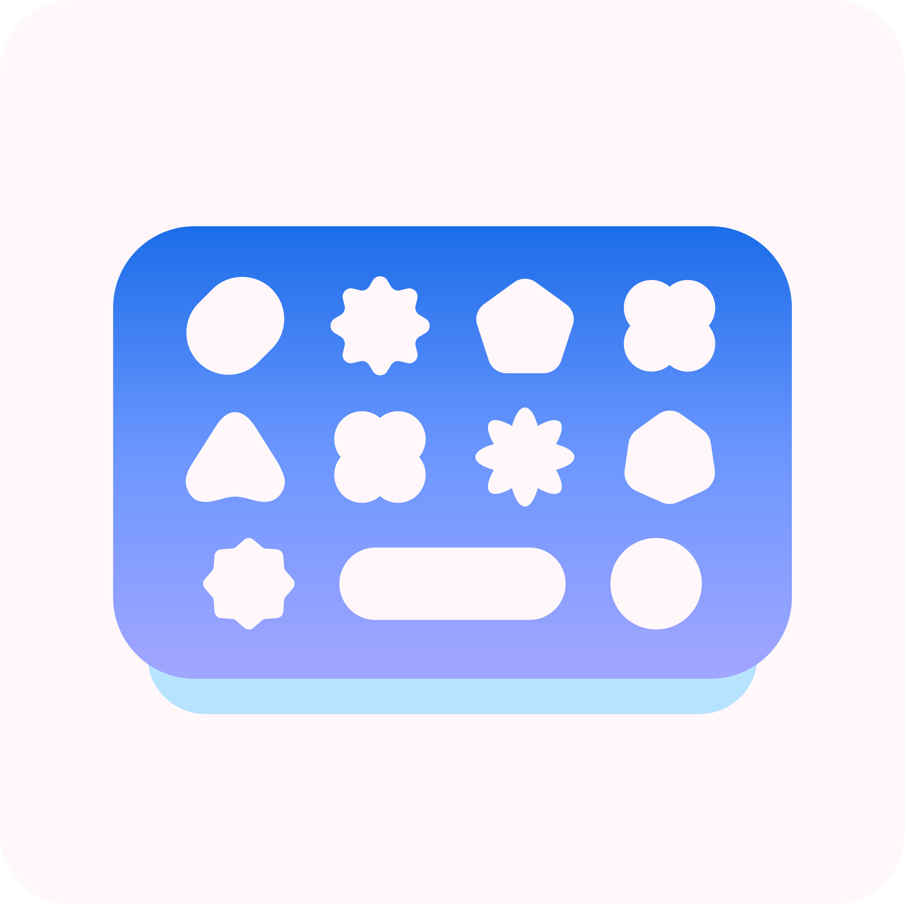
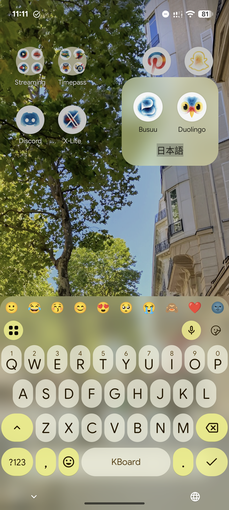
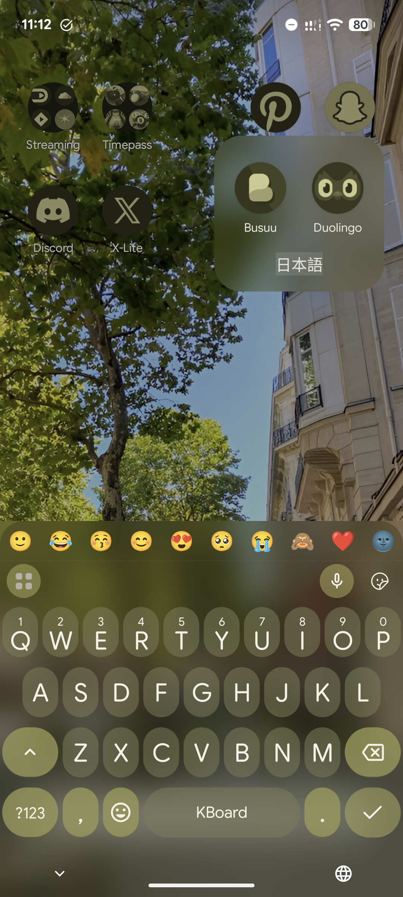
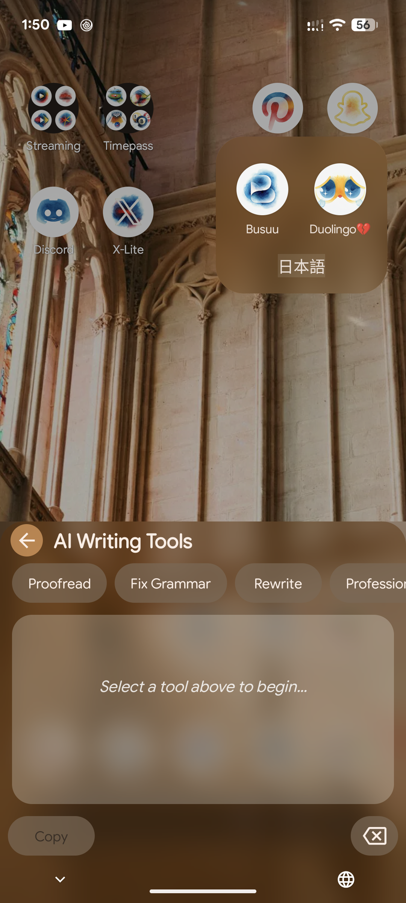
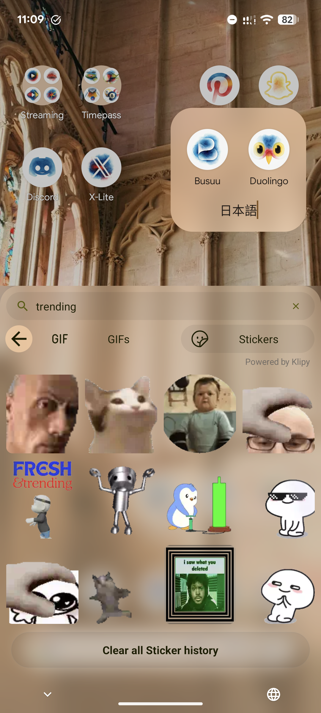

# FrostKeys

**A personalized fork of [HeliBoard](https://github.com/HeliBorg/HeliBoard) with Blur UI effects, AI writing tools, and Klipy GIF & animated sticker support.**

FrostKeys takes the privacy focused foundation of HeliBoard and adds modern, high performance features for users who want more from their keyboard without sacrificing their data.
>
> [!NOTE]
> ### 🚀 Distribution & Availability
> **FrostKeys is transitioning to official distribution via Google Play Store.**
> * **Closed Beta:** Currently underway (all tester slots are currently full).
> * **Public Launch:** Will be available directly on Google Play Store upon completing the closed testing phase.
> * **GitHub Releases:** Pre-compiled standalone APK binaries are no longer hosted here. In full compliance with the GPL v3.0 license, the complete source code remains open in this repository for local compilation and inspection.
>
> ⚠️ **Important Security Notice**
> 
> **Avoid Sideloading Unofficial Builds & Extracted APKs**
> 
> A keyboard app handles your most sensitive inputs such as passwords, private messages, and personal credentials. Sideloading forwarded APKs or unofficial builds from third party channels carries high risks of tampering and keylogging injection. Only official builds on Google Play Store carry verified developer signatures and receive direct bug/security updates.
> 
> So please consider getting the app only from the official source, and wait for the full store release. 
---

## 📸 Screenshots

  
  
  
  

---

## 📋 Table of Contents
- [New Features](#-new-features)
- [Original Features](#original-features-from-heliboard)
- [Contributing & Support](contributing--support-#)
- [License & Legal](#license--legal)
- [Credits](#credits)

---

## ✨ New Features

### 1. The All-New Klipy Media Panel (GIFs & Animated Stickers)
The Emoji and Media panel has been completely rebuilt to integrate the Klipy API, bringing an endless library of media right to your keyboard.
* **Beautiful Layouts:** Browse GIFs in a gorgeous, staggered "river view" and find stickers in a clean, easy-to-tap 4-column grid.
* **Flawless WhatsApp Integration:** Say goodbye to the share sheet and flattened static images! FrostKeys uses a custom-built `libwebp` processing engine to format and drop animated stickers *directly* into your WhatsApp chat bubbles with full animation intact.
* **Bring Your Own Key:** Just like our AI tools, you are in control. Simply input your own personal Klipy API key in the settings to unlock unlimited GIF and sticker searches.

### 2. Frosted Glass Design (Material You Evolution)
Experience a modern, high-fidelity UI with our brand-new **Frosted Glass** engine.
* **Dynamic Blur:** Real-time background blur for both Light and Dark modes.
* **Fully Customizable:** Adjust the opacity, saturation, and "frost" intensity to match your wallpaper and device aesthetic.

> [!NOTE]
> ### ⚠️ Live Background Blur & Device Compatibility
> Live background blur relies directly on **Android 12+ native cross-window blur APIs**. Because this is hardware and OEMdependent, compatibility varies:
> 
> * **Hardware Support Required:** The feature only works on devices running **Android 12 or newer** where the manufacturer has enabled native window blur support.
> * **OEM Limitations:** Many brands disable real time window blurs on budget and mid-range devices to preserve performance, meaning the frosted effect will not render. Some manufacturers (like Samsung on budget devices) use a static snapshot blur in the UI, this is not a true real time blur and does not guarantee support for live keyboard blur.
> * **Legacy Versions & Crashes:** On older Android versions or unsupported hardware, enabling blur effects may cause instability or crashes.
> 
> *If you experience crashes or visual glitches when toggling blur on your device, please share the logfile and report it in the [Telegram Group](https://t.me/FrostKeys) so we can implement a proper fallback for your device model.*

### 3. Access Point Menu (Enhanced Toolbar)
We have retired the old static toolbar in favor of the **Access Point Menu**.
* **Modernized Layout:** A cleaner, more intuitive way to access settings, clipboard, and one-handed mode.
* **Modular Design:** Faster navigation with refined iconography.

### 4. Selective Internet Capabilities
While the core of the keyboard remains offline-first, we have added **optional** internet capabilities. (Yes! you can turn it off! 😉)
* **Privacy Toggle:** Internet access is disabled by default. You decide when the keyboard connects to the web.
* **Safe Connectivity:** Built specifically to power AI and Klipy Media features while keeping your keystrokes private.

### 5. Gemini AI Integration
FrostKeys brings modern AI writing tools directly into your text field.
* **AI Writing Assistant:** Proofread, rewrite, or change the tone of your text instantly.
* **Bring Your Own Key:** Powered by Google Gemini. Simply input your own Gemini API key in settings to unlock local AI power without subscription fees.

### 6. Material Design 3 Expressive UI
FrostKeys embraces Google's latest **Material Design 3 Expressive** design language, delivering a fluid, modern visual experience.
* **Expressive Styling:** Redesigned Ui elements, refined shapes, and modernized dynamic color palettes that seamlessly match your system theme.
* **Refreshing Animations:** Smooth, tactile motion and bouncy physics integrated throughout.
---

## Original Features From HeliBoard
* **Privacy-First:** Based on AOSP / OpenBoard.
* **Custom Dictionaries:** Add your own for suggestions and spell check.
* **Multilingual Typing:** Support for over 70+ languages.
* **Glide Typing:** Support for library extraction (swypelibs).
* **Backup & Restore:** Easily move your learned words and settings to a new device.

---

## 🛠️ Tech Stack

| Category | Technology |
| :--- | :--- |
| **Languages** | [Kotlin](https://kotlinlang.org/) + [Java](https://dev.java/) + [C/C++ (NDK)](https://developer.android.com/ndk) |
| **UI Framework** | [Jetpack Compose](https://developer.android.com/compose) + Android View System |
| **Design System** | [Material Design 3](https://m3.material.io/) + Custom Frosted Glass Engine |
| **Glassmorphism / Blur** | [Haze](https://github.com/chrisbanes/haze) + `RenderEffect` |
| **AI Engine** | [Google Gemini API](https://ai.google.dev/) |
| **Media & GIF Engine** | [Klipy API](https://klipy.co/) + [webp-android](https://github.com/aureusapps/webp-android) (`libwebp` JNI) |
| **Image Loading** | [Coil](https://coil-kt.github.io/coil/) (Static Images & GIFs) |
| **Networking & Serialization** | [OkHttp 3](https://square.github.io/okhttp/) + `kotlinx.serialization` |
| **Build & Tooling** | Gradle (Kotlin DSL), NDK (ndk-build) |

---

## Contributing & Support ❤️
FrostKeys is a personal project, but the heavy lifting was done by the HeliBoard team.

### Support FrostKeys
If you love using FrostKeys and want to support ongoing development, maintenance, and new features, consider becoming a sponsor! Every bit of support directly helps keep this project alive and ad-free.

---

### Support HeliBoard
**Please support the upstream HeliBoard project!** This fork would not be possible without their incredible work on open-source privacy. You can support them via their official channels:
* **GitHub:** [HeliBorg/HeliBoard](https://github.com/HeliBorg/HeliBoard)
* **Wiki & FAQ:** [HeliBoard Wiki](https://github.com/HeliBorg/HeliBoard/wiki)
* **Issues:** [HeliBoard Issue Tracker](https://github.com/HeliBorg/HeliBoard/issues)

---
## 📢 Join Our Community!

If you enjoy using FrostKeys, please consider giving the repository a ⭐️! Have feedback or suggestions? Drop by the [Telegram Channel](https://t.me/FrostKeys) and let us know!

---

## License & Legal

**FrostKeys** is a fork of **HeliBoard** (which is based on **OpenBoard** and **AOSP LatinIME**). 

As a derivative work, FrostKeys is licensed under the **GNU General Public License v3.0**. 

* **Copyleft Requirement:** In accordance with the GPL v3.0, the complete source code for FrostKeys is made available in this repository. Any further modifications or forks of FrostKeys must also be released under the same GPL v3.0 license.
* **Preservation:** All original copyright and license notices from the HeliBoard, OpenBoard, and AOSP projects have been preserved in the source headers.
* **Apache 2.0:** Since the app is based on the Apache 2.0 licensed AOSP Keyboard, those original terms also apply.
* **Brand Assets:** The **FrostKeys** icon (by Orion) is licensed under [Creative Commons BY-SA 4.0](https://creativecommons.org/licenses/by-sa/4.0/).

> [!IMPORTANT]
> No fork of this project will receive support, If you are using a third-party fork or custom build, please direct questions and issue reports to that fork's maintainer.

**Disclaimer:** *Google Gemini is a trademark of Google LLC. Klipy is a trademark of Klipy. FrostKeys is not affiliated with or endorsed by Google or Klipy. Use of Gemini and Klipy features requires personal API keys and is subject to their respective Terms of Service.*

---

## Credits
- **Ashwin Soni (Orion):** Fork maintainer; creator of the Frosted Glass UI, Klipy media pipeline, and AI implementation. [@AshwinSoni1](https://t.me/AshwinSoni1)
- **Syntrop:** UI/UX design contributions and official app icon. [@Syntrop2k2](https://t.me/Syntrop2k2)
- **HeliBoard Team:** For the industry-leading open-source foundation.
- **NGI Mobifree Fund:** Funding provided to the original HeliBoard project through [NLnet](https://nlnet.nl).
- **AOSP / OpenBoard:** The ancestors of this project.

---

  Made with ❤️ by <a href="https://github.com/AshwinSoni-01">Ashwin Soni (Orion)</a>

